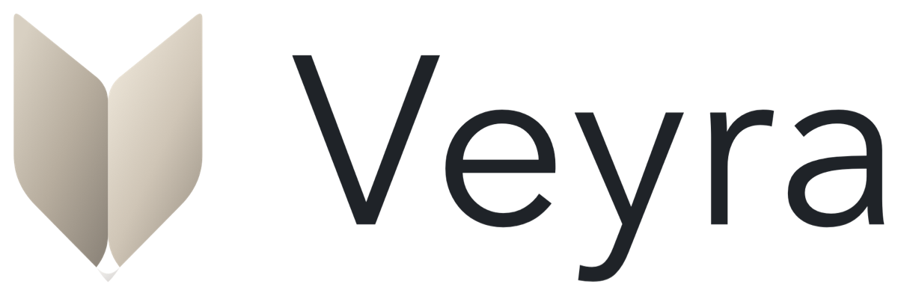

# Veyra

**English** · [简体中文](README.zh-CN.md)

<picture>
  <source media="(prefers-color-scheme: dark)" srcset="assets/brand/veyra-logo-preview-dark.png">
  
</picture>

Veyra is a native Swift 6 and SwiftUI menu bar app for monitoring Codex quotas and local tasks. It shows quota windows and reset times alongside active tasks, models, elapsed time, and token usage without getting in the way of your work.

## Requirements

- macOS 14 or later.
- Codex Desktop or the Codex CLI installed and signed in.
- The local `codex` executable is only required for manual online quota calibration. No API key is needed.

## Install

Download the latest archive from [GitHub Releases](https://github.com/yuzio-ai/veyra/releases), unzip it, and move `Veyra.app` to the Applications folder. Launch Veyra from Applications; it appears only in the menu bar and does not add a Dock icon.

## Use

Press **Control + Option + V** (`⌃⌥V`) from any app to show or hide the panel while Veyra is running. Press **Esc** or click outside to close it. In **Settings → Keyboard Shortcut**, record a different combination, disable the shortcut, or restore the default. Include Control, Option, or Command; Shift is optional. Recording pauses the active shortcut, and Esc or leaving the recorder cancels it. Conflicts are shown in settings without replacing your previous choice. No Accessibility or Input Monitoring permission is required.

Click the Veyra menu bar icon to inspect active task families, task status, elapsed time, token totals, and the latest local quota snapshots. Use the quota refresh button when you want to calibrate those snapshots against the signed-in Codex account. If automatic Codex discovery does not match your installation, set the executable or data directory in Veyra settings. Valid paths apply automatically when you press Return, leave the field, or confirm a file selection. Clear a field to use automatic detection; **Restore automatic detection** clears both overrides.

Veyra checks the public GitHub Releases feed on launch and when opening the menu, at most once every 24 hours. Turn off automatic checks or use **Check for Updates…** in Settings → **Software Update**. When a newer version is available, **Go to Download** opens that release in your browser. Download the app archive, quit Veyra, and replace it in Applications; Veyra does not download or install updates itself. Update checks use no GitHub token or Codex credentials.

Veyra monitors existing local data in read-only mode. It does not create, resume, or control tasks, trigger model requests, copy credentials, or modify Codex databases and session files.

Uncertain tasks are hidden after 24 hours without recorded activity when a successful process check finds no matching Codex process. Tasks with matching processes remain visible regardless of age; failed process checks keep the existing uncertain status and warning. This display filter does not modify task history.

Veyra supports English and Simplified Chinese and follows your macOS language preferences. To choose a language just for Veyra, add it under **System Settings → General → Language & Region → Applications**, then restart Veyra. English is used when none of your preferred languages is supported. Dates and times follow your regional settings. Task titles and original Codex progress text are shown as recorded.

## Documentation

Detailed documentation is currently available in Chinese:

- [User guide](docs/user-guide.zh-CN.md)
- [Data, privacy, and compatibility](docs/data-and-privacy.zh-CN.md)
- [Development](docs/development.zh-CN.md)
- [Manual release runbook](docs/release.zh-CN.md)
